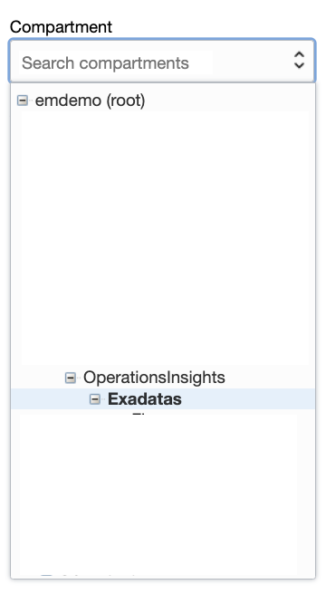

# Capacity Planning of Oracle Exadata

## Introduction

In this lab, you will go through the steps to explore Capacity Planning of Oracle Exadata.

Estimated Time: 20 minutes

### Objectives

-   Explore Capacity Planning Oracle Exadata.

### Prerequisites

This lab assumes you have completed the following labs:
* Lab: Enable Demo Mode

## Task 1: Exadata Fleet

1.  On the **Operations Insights Overview** page, from the left pane select **Exadatas** compartment.

      

2.  On the **Operations Insights Overview** page, from the left pane click on **Administration** and then click on **Exadata Fleet**.

      

3.  This will bring up **Exadata Fleet Administration** page, where all registered Exadata systems are displayed.

      

4.  Click on **X6-2\_Full_DBM08.us.oracle.com** Exadata System to see the Databases and Hosts associated with this Exadata System.

      

5.  From the left pan click on **Hosts** to view the hosts associated with this Exadata System.

      

6.  Select individual Database and Host and then click **Actions** and **Re-Enable Operations Insights** / **Disable Operations Insights** to manage and remove or enable the OPSI functionality.

      

## Task 2: Exadata Insights

1.  Click on **Operations Insights** to go to the Overview Page.

      

2.  On the **Overview** page, click on **Exadata Insights** from the left pane.

      

3.  This will show the Exadata systems registered for Operations Insights.

      

4.  On this page, the aggregate view of all the discovered Exadata systems will be shown.

5.  Also, the current and forecast utilization of the Exadata system will be shown on the bottom section.

Now click on a Exadata system to evaluate more insights. Let’s choose a full stack for this lab.

This page will land on the Rack and Key Metrics. Highlight the software and hardware summary.

Navigate to Metrics by Database on the left pane.

Select CPU tab and choose the Host under Grouping.
Now choose ‘Max Allocation’ under size and Usage Change (%) under color
Highlight the hosts with maximum CPU utilization and the databases which consume the highest CPU.
Now show the trend & forecast of CPU for Host and Database. Click on the host name and highlight the trend graph.
Similarly Select the database and highlight the trend and forecast graph.
Likewise navigate to Storage, Memory and IOPS and evaluate the different trend and forecast graphs. Now select Metrics by Host on the left pane.
On this page, click on the CPU tab, select All hosts to see the aggregate trend & forecast. Also choose the individual host to show the drilled down trend and forecast.
Switch to Exadata Storage Server option on the left pane.
Select Individual data series on the top right pane to show the individual storage utilization.
Now select Aggregate data series and forecast option.

In Conclusion, OPSI Exadata Insights provides comprehensive capacity analysis to give administrators the ability to view, analyze, proactively forecast, and detect potential constraints in Exadata resources. As a system administrator they want to be able to make critical decisions to optimize their Exadata stacks; plan for growth, compare resource usage and perform what-if analysis for various scenarios.

## Acknowledgements

- **Author** - Vivek Verma, Master Principal Cloud Architect, North America Cloud Engineering
- **Contributors** - Vivek Verma, Sriram Vrinda, Derik Harlow
- **Last Updated By/Date** - Vivek Verma, May 2022